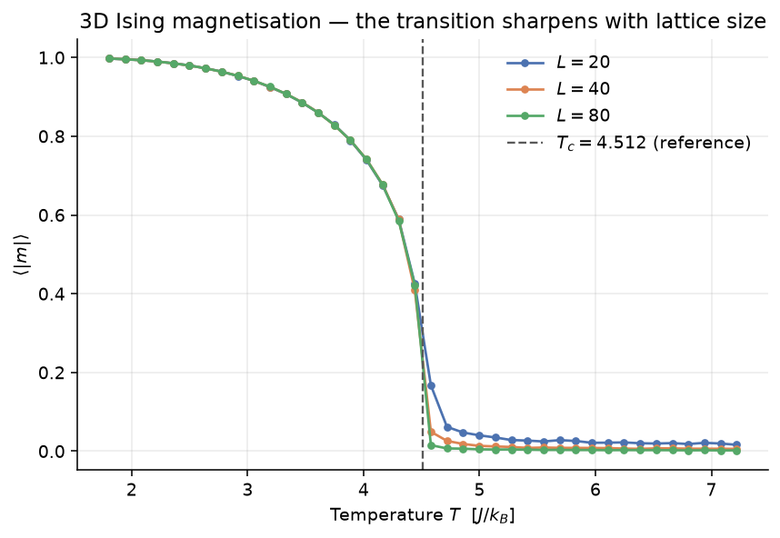
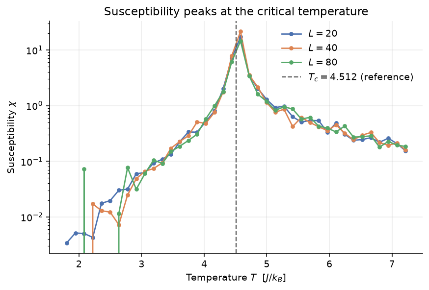
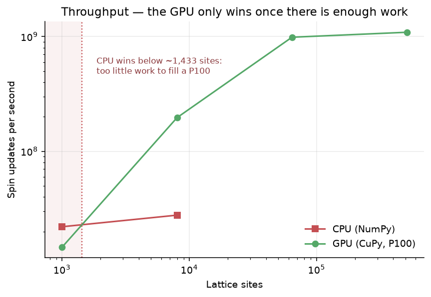

# GPU-Accelerated Ising Model

GPU-accelerated Monte Carlo simulation of the 3D Ising model, validated against
exact mathematical results rather than against how the plots look.

Runs on CPU (NumPy) and GPU (CuPy) from a single physics implementation.
Saturates at **1.09·10⁹ spin updates per second** on a Tesla P100.

**I first wrote this in 2024 as four Jupyter notebooks during my physics
master's. This is the 2026 rebuild, using the architecture I use for production
systems. Writing the tests surfaced five real physics bugs — three in the
original, and two I introduced in the rewrite. The 2024 version is preserved
untouched in [`legacy/`](legacy/) so the difference is inspectable.**

That is the point of the repository: not that the code is clean, but that
verification against ground truth catches errors which plausible-looking output
does not.

---

## Results

Tesla P100-PCIE-16GB, CuPy 14.0.1. Each run sweeps 40 temperatures held as
parallel replicas. Raw output is committed in [`data/reference/`](data/reference/).



The transition sharpens as the lattice grows and lands on the reference
`T_c = 4.5115`. The curves collapse onto one another below `T_c` — three
independent lattice sizes agreeing is a stronger statement than any one of
them.



| run | χ peak | vs `T_c` | ⟨\|m\|⟩ at T=1.8 | E/site at T=1.8 | ⟨\|m\|⟩ at T=7.2 |
|---|---|---|---|---|---|
| L=20 NumPy | 4.442 | −1.5% | 0.9973 | −2.9839 | 0.0176 |
| L=20 CuPy | 4.581 | +1.5% | 0.9972 | −2.9834 | 0.0162 |
| L=40 CuPy | 4.581 | +1.5% | 0.9973 | −2.9837 | 0.0060 |
| L=80 CuPy | 4.581 | +1.5% | 0.9972 | −2.9835 | 0.0021 |

The temperature grid spacing is 0.139, so every peak sits within one grid step
of the reference value. Three consistency checks hold simultaneously:

- **No domain artefact.** The ground-state energy is `−3`; every run reports
  `−2.984` *alongside* ⟨|m|⟩ = 0.997. Both observables agree the lattice is
  ordered.
- **Correct finite-size scaling.** Disordered-phase magnetisation falls as
  `1/√N` across L = 20 → 40 → 80: measured ratios 2.7 and 2.9 against a
  predicted 2.83.
- **Backends agree.** CuPy matches the NumPy oracle to within 0.05 in ⟨|m|⟩,
  the residual sitting where critical fluctuations genuinely differ between two
  RNG streams.

### Throughput



| backend | L | sites | seconds | spin updates/s |
|---|---|---|---|---|
| NumPy | 10 | 1,000 | 3.63 | 2.20·10⁷ |
| NumPy | 20 | 8,000 | 23.04 | 2.78·10⁷ |
| CuPy | 10 | 1,000 | 5.47 | 1.46·10⁷ |
| CuPy | 20 | 8,000 | 3.25 | 1.97·10⁸ |
| CuPy | 40 | 64,000 | 5.18 | 9.88·10⁸ |
| CuPy | 80 | 512,000 | 37.54 | 1.09·10⁹ |

**Below roughly 1,400 sites the GPU is slower than the CPU.** A lattice that
small cannot fill a P100, so kernel-launch overhead dominates. That row stays in
the table deliberately: a speedup quoted without the size at which it disappears
is marketing, not measurement.

Timings call `deviceSynchronize()` before stopping the clock. CuPy is
asynchronous — timing without it measures how fast Python enqueues kernels
rather than how fast they run.

---

## What the tests found

Three bugs were in the 2024 notebooks.

**1. The boundaries were not periodic.** Nearest-neighbour sums used a
convolution with `padding='same'`, which pads with **zeros** — surface sites
were coupled to phantom neighbours of spin 0 instead of wrapping to the
opposite face. On a 20³ lattice, 49% of sites touch a face.

**2. The total energy was double-counted.** `E = −J Σ⟨ij⟩ sᵢsⱼ` sums over
*bonds*; summing per-site energies visits each bond twice. The missing factor
of ½ became a factor of four in the heat capacity, which depends on the
*variance* of E.

**3. Magnetisation was averaged with its sign.** Below `T_c` a finite system
tunnels between the two ordered states, so ⟨m⟩ averages toward zero even when
the system is fully ordered. ⟨|m|⟩ is the observable that survives finite size.

Two I introduced in the rewrite, and only ground truth caught them.

**4. Metropolis is not ergodic under a checkerboard update.** Metropolis
accepts `ΔE = 0` with probability **one**, and a checkerboard update decides
every site of a sublattice simultaneously — so whole sublattices flip in
deterministic lockstep. On the 1D ring, where `ΔE = 0` whenever a site's two
neighbours are antiparallel, `(−,−,+,+) ⇄ (+,+,−,−)` becomes a closed orbit the
chain can never leave.

The sampler does not look broken: it still returns a Boltzmann distribution,
over the wrong support, renormalised. Sampled probabilities came out at a
uniform 1.22× the exact values with four states at exactly zero. Only the exact
512-state sum exposed it. Heat-bath (Glauber) accepts `ΔE = 0` with probability
½; the coin flip restores irreducibility.

> **Detailed balance is not enough.** Invariance of the target distribution says
> nothing about whether the chain can reach all of it.

**5. A random start is a quench.** Seeding randomly below `T_c` fragments the
lattice into domains whose walls coarsen too slowly to clear a 1000-sweep
burn-in at large `L`:

| | T | hot start | cold start |
|---|---|---|---|
| L=48 | 2.08 | **0.2416** | 0.9929 |
| L=80 | 1.80 | **0.5529** | 0.9972 |

The tell was a contradiction between two observables — energy at 98% of the
ground state (near-perfect *local* order) alongside ⟨|m|⟩ = 0.55 (no *global*
alignment). The trapped temperature moves with lattice size and seed, so the
damage appeared as isolated spikes in an otherwise healthy curve. It shifted
the apparent `T_c` by up to 60%.

> **When two observables imply different physics, believe the contradiction,
> not the prettier plot.**

Both defects are now pinned by tests that assert they *fail*, so that if a
future change ever made either safe, the claim gets re-examined rather than
silently inherited.

---

## Validation

33 tests, none of which assert "it did not crash".

| Check | Reference |
|---|---|
| Energy and ⟨\|m\|⟩ on 8-site and 4×4 lattices | Brute-force sum over all 2^N states |
| 1D chain energy per site | Exact finite-size solution |
| 1D has no phase transition | Textbook result |
| 2D critical temperature | Onsager: `T_c = 2/ln(1+√2) ≈ 2.269` |
| 2D magnetisation below `T_c` | Onsager: `m = [1 − sinh⁻⁴(2βJ)]^{1/8}` |
| High-temperature limit | Independent spins: ⟨\|m\|⟩ → √(2/πN) |
| Ground-state energy | `E = −J·N·d` exactly |
| Predicted ΔE vs an actual flip | Internal consistency of the acceptance rule |
| Metropolis fails where heat-bath succeeds | Brute-force sum (ergodicity) |
| Hot and cold starts disagree at large L | Equilibration (start-independence) |
| Odd lattices are rejected | Bipartiteness of the periodic lattice |
| Identical seeds give identical output | Reproducibility |

The NumPy backend is the **oracle**, not a fallback: on small lattices its
output can be checked against closed-form results and the full Boltzmann state
sum. If CuPy disagrees with NumPy, CuPy is wrong.

---

## Usage

```bash
uv venv && uv pip install -e ".[dev,plots]"

python scripts/run_sweep.py --dim 2 --size 32 --backend numpy   # CPU, anywhere
python scripts/run_sweep.py --dim 3 --size 80 --backend cupy    # GPU
python scripts/plot_sweep.py                                    # figures from committed CSVs

pytest -m "not slow"    # fast suite
pytest                  # includes the large-lattice equilibration check
```

Runs write a CSV plus a JSON manifest of every parameter, seed included. The
sweep script draws nothing and opens no windows, which is what lets it run
unchanged inside a batch job. `kaggle/` contains the batch job used to produce
the results above.

Lattice dimensions must be **even** — a periodic lattice with an odd dimension
is not bipartite, and the code raises rather than producing plausible numbers
from an invalid update rule.

---

## Documentation

- **[docs/physics.md](docs/physics.md)** — the model, the sampler, why detailed
  balance is not enough, and where every reference value comes from
- **[docs/architecture.md](docs/architecture.md)** — the backend port, layer
  boundaries, measurement strategy, and testing approach

---

## License

MIT
